# ARC-YOLO: Adaptive Enhancement and Cross-Fusion for Microscopic Residual Oil Detection

<p align="center">
  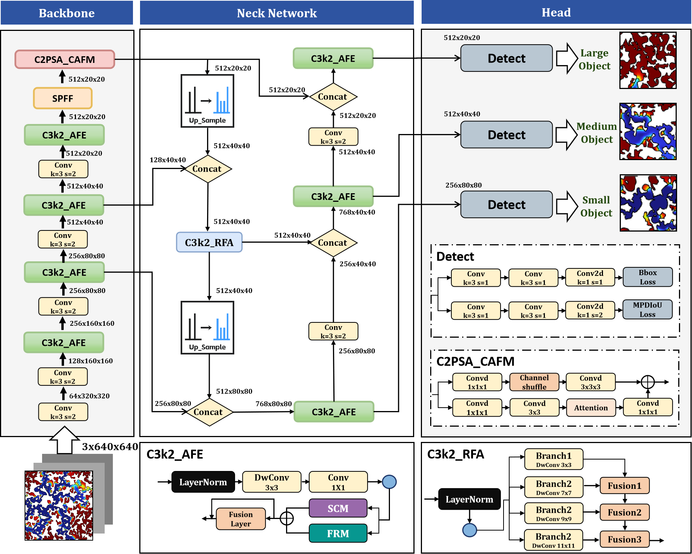
</p>

<p align="center">
  <a href="https://github.com/Lutra11/ARC-YOLO"><strong>Code</strong></a> |
  <a href="#-key-results">Results</a> |
  <a href="#-installation">Installation</a> |
  <a href="#-quick-start">Quick Start</a> |
  <a href="#-citation">Citation</a>
</p>

## 📋 Overview

**ARC-YOLO** is a novel object detection framework built upon [YOLO11](https://github.com/ultralytics/ultralytics), specifically designed for **microscopic residual oil detection** in ultra-high water-cut reservoirs. It addresses three key challenges:

- **Weak visual features** — low contrast at oil-water interfaces causes edge/texture degradation
- **Multi-scale variation** — residual oil morphologies (clustered, columnar, membranous, corner-shaped, island-like) vary greatly in size
- **Complex background interference** — water-phase flow and noise reduce the signal-to-noise ratio

### 🔑 Key Contributions

1. **AFE Module (Adaptive Feature Enhancement)** — Enhances weak textures and edge details via a dual-path spatial context mechanism and feature refinement strategy
2. **RFA Module (Receptive Field Aggregation)** — Strengthens multi-scale feature representation through hierarchical multi-scale large-kernel convolutions (3×3, 7×7, 9×9, 11×11)
3. **CAFM (Cross-Attention Fusion Module)** — Fuses local convolutional features with global channel self-attention for superior feature discrimination
4. **MPDIoU Loss** — Replaces CIoU with a corner-distance minimization strategy for better localization of irregular targets

## 📊 Key Results

| Metric | YOLO11 (baseline) | **ARC-YOLO (ours)** | Improvement |
|:------:|:-----------------:|:-------------------:|:-----------:|
| mAP@50 | 64.73% | **90.45%** | +25.72% |
| mAP@50-95 | 55.61% | **72.27%** | +16.66% |
| Precision | 67.25% | **83.78%** | +16.53% |
| GFLOPs | 7.4 | **7.4** | — |
| FPS | 110.14 | **108.18** | -1.8% |
| Parameters | 2,834,638 | **2,891,079** | +0.2% |

> ARC-YOLO achieves a **+16.66% improvement** in mAP@50-95 over YOLO11 while maintaining comparable computational efficiency (7.4 GFLOPs, ~108 FPS).

### Performance Comparison

<p align="center">
  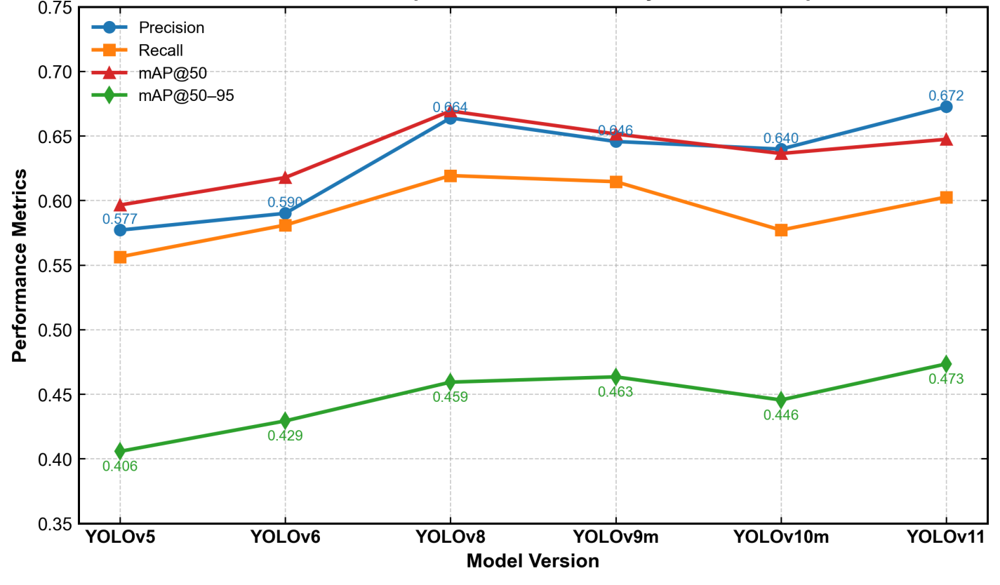
</p>

<p align="center">
  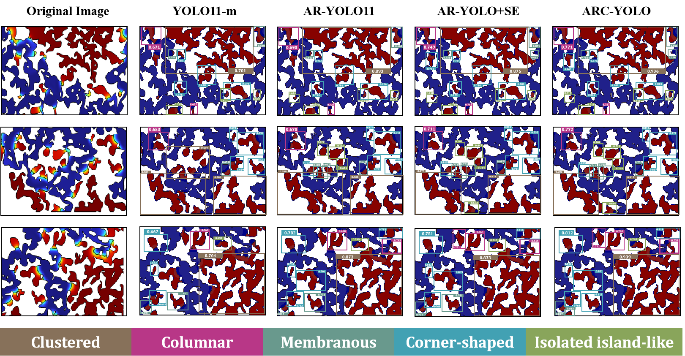
</p>

### Detection Heatmaps

<p align="center">
  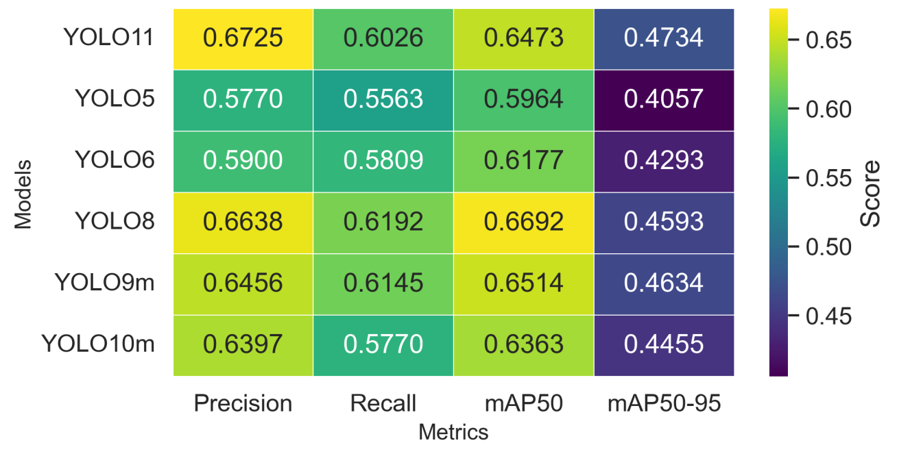
</p>

<p align="center">
  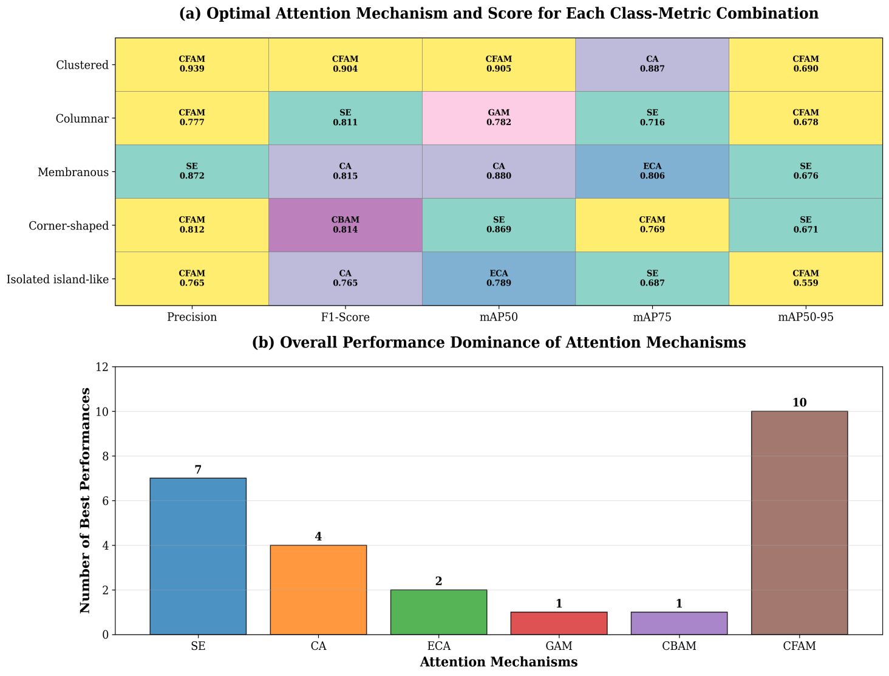
</p>

## 🏗️ Architecture

### Overall Framework

<p align="center">
  
</p>

ARC-YOLO follows a progressive design strategy:
1. **AFE** → strengthens weak feature representation in the backbone
2. **RFA** → expands multi-scale receptive field in the neck
3. **CAFM** → fuses local details with global context

### AFE Module (Adaptive Feature Enhancement)

<p align="center">
  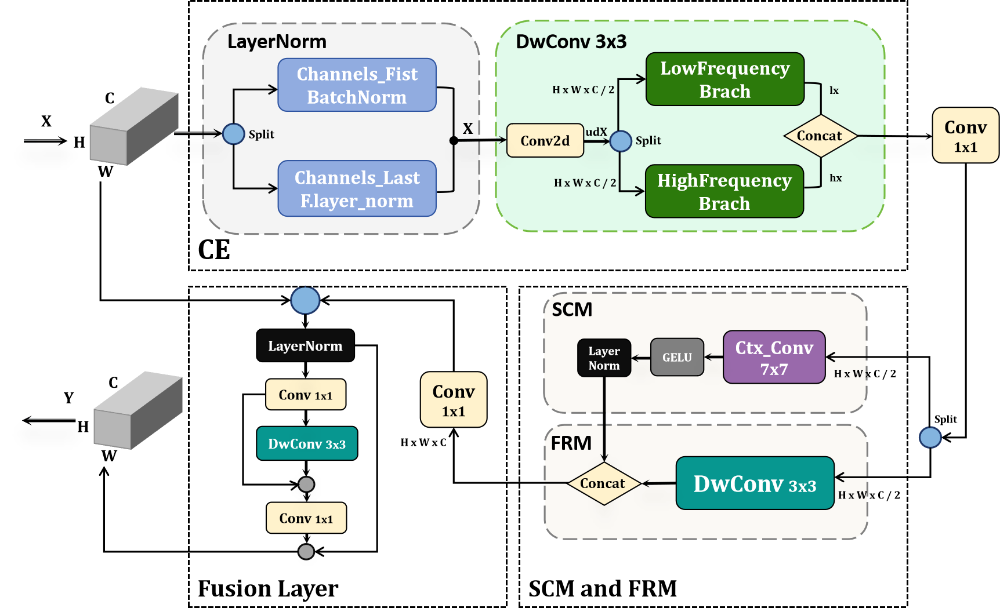
</p>

The AFE module consists of four components:
- **Convolution Embedding (CE)** — LayerNorm + depthwise convolution for initial feature enhancement
- **Spatial Context Module (SCM)** — Large-kernel group convolution for global spatial information
- **Feature Refinement Module (FRM)** — High/low-frequency fusion for edge detail enhancement
- **Fusion Layer** — 1×1 convolution + ConvMLP for final enhanced representation

### C3k2_RFA Module (Receptive Field Aggregation)

<p align="center">
  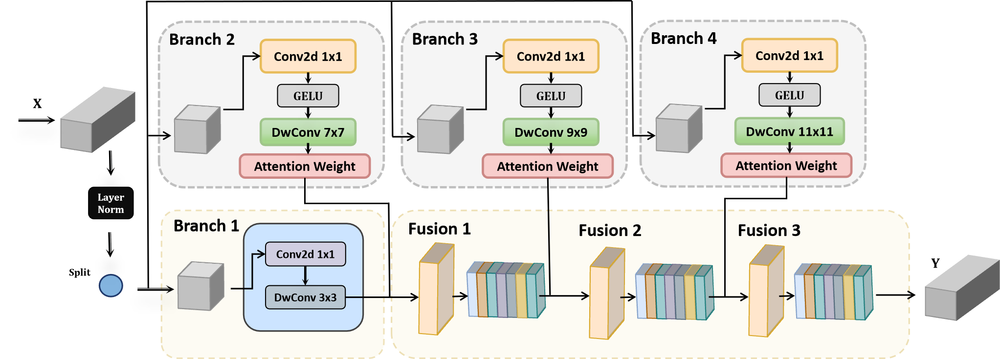
</p>

Multi-scale receptive field branches:
| Branch | Kernel Size | Focus |
|:------:|:----------:|:-----:|
| 1 | 3×3 | Local detail extraction |
| 2 | 7×7 | Local-to-mid-range context |
| 3 | 9×9 | Mid-range context |
| 4 | 11×11 | Large-scale global context |

### CAFM Module (Cross-Attention Fusion)

<p align="center">
  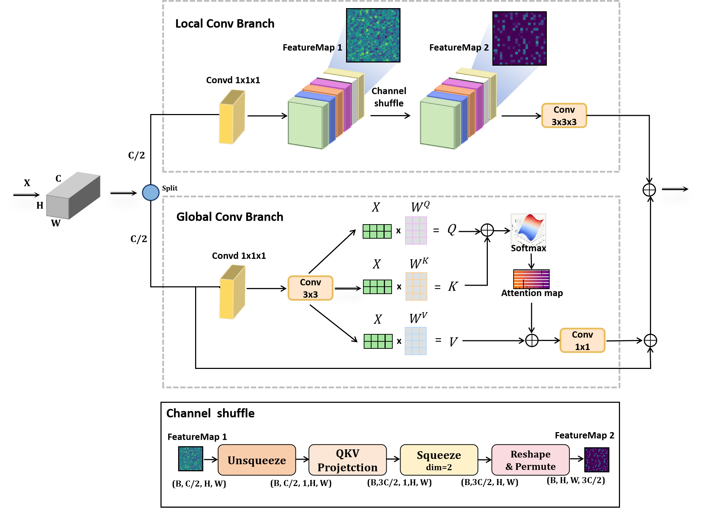
</p>

Dual-branch parallel structure:
- **Local Feature Enhancement Branch** — Lightweight 2D convolution + Channel Shuffle for fine-grained spatial features
- **Global Context Aggregation Branch** — Efficient channel-dimension self-attention for long-range dependencies

## 📁 Dataset

### Microscopic Residual Oil Dataset

<p align="center">
  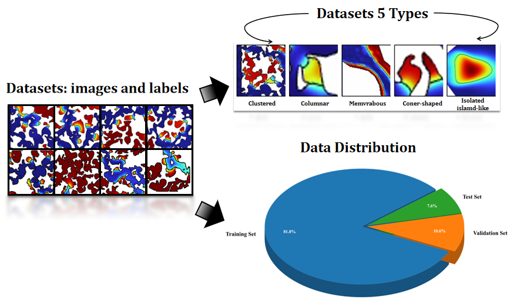
</p>

The self-constructed dataset contains **7,165 microscopic residual oil images** with 5 morphological categories:

| Category | Description |
|:--------:|:------------|
| Clustered | Large-scale aggregated oil distributions |
| Columnar | Elongated oil columns in pore channels |
| Membranous | Thin oil films along grain surfaces |
| Corner-shaped | Small oil droplets in pore corners |
| Isolated island-like | Sparse, small oil patches |

**Data split:** Training 81.8% / Validation 10.6% / Test 7.6%

### CT Imaging Process

<p align="center">
  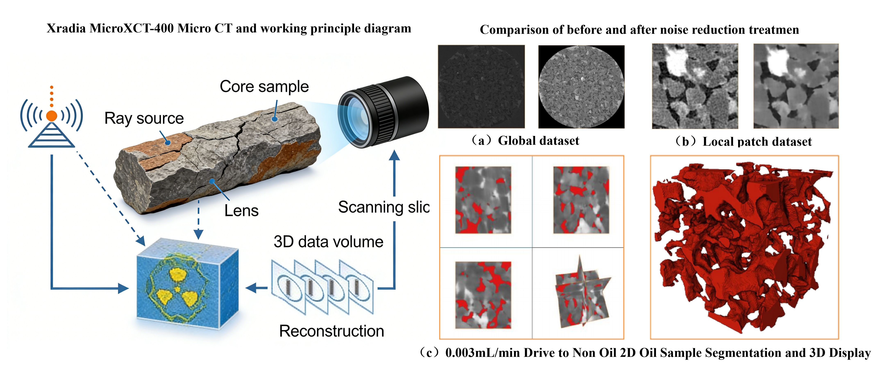
</p>

### Data Preprocessing (K-means Clustering)

<p align="center">
  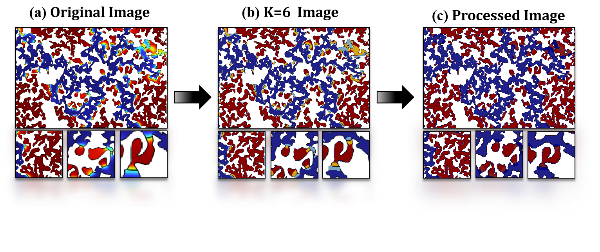
</p>

K-means clustering (K=6) partitions pixel color space to separate oil-bearing, water-bearing, and mixed zones, followed by binarization.

## 🔧 Installation

### Prerequisites

- Python ≥ 3.9
- PyTorch ≥ 2.0 with CUDA support
- [ultralytics](https://github.com/ultralytics/ultralytics)

### Setup

```bash
# Clone the repository
git clone https://github.com/Lutra11/ARC-YOLO.git
cd ARC-YOLO

# Install dependencies
pip install ultralytics timm einops
```

## 🚀 Quick Start

### Training

```python
from ultralytics import YOLO

# Load ARC-YOLO model
model = YOLO("ultralytics/cfg/ARC_models/11_ARC/yolo11_AFE_RFA_CAFM.yaml")

# Train
model.train(
    data="path/to/your/data.yaml",
    epochs=150,
    imgsz=640,
    batch=16,
    device=0,
    lr0=0.01,
    lrf=0.01
)
```

### Inference

```python
from ultralytics import YOLO

# Load trained model
model = YOLO("runs/detect/train/weights/best.pt")

# Run inference
results = model("path/to/image.png", conf=0.25)
results[0].show()
```

### Using MPDIoU Loss

To use the MPDIoU loss function, update the loss configuration in your training script or modify the `bbox_loss` in `ultralytics/utils/loss.py`:

```python
# In ultralytics/utils/loss.py, replace CIoU with MPDIoU
from ultralytics.utils.metrics import bbox_iou

# MPDIoU implementation
def mpdiou_loss(pred_boxes, target_boxes, img_size):
    # See paper for detailed formulation
    ...
```

## 📂 Repository Structure

```
ARC-YOLO/
├── images/                          # README images
│   ├── architecture.png             # Overall ARC-YOLO architecture
│   ├── afe_module.png               # AFE module structure
│   ├── c3k2_rfa.png                 # C3k2_RFA module structure
│   ├── cafm_module.png              # CAFM module structure
│   ├── dataset.png                  # Dataset examples
│   ├── ct_imaging.png               # CT imaging process
│   ├── preprocessing.png            # K-means preprocessing
│   ├── yolo_comparison.png          # YOLO performance comparison
│   ├── heatmap.png                  # Detection performance heatmap
│   ├── attention_heatmap.png        # Attention mechanism heatmap
│   └── accuracy_comparison.png      # Accuracy comparison chart
├── datasets/                        # Dataset configuration
├── ultralytics/
│   ├── cfg/
│   │   └── ARC_models/
│   │       ├── 11_ARC/              # ARC-YOLO model configs
│   │       │   ├── yolo11_AFE_RFA_CAFM.yaml   # Full ARC-YOLO
│   │       │   ├── yolo11_AFE.yaml             # AFE only
│   │       │   ├── yolo11_RFA.yaml             # RFA only
│   │       │   ├── yolo11_CAFM.yaml            # CAFM only
│   │       │   └── yolo11_AFE_RFA.yaml         # AFE + RFA
│   │       ├── 11_Attention/        # Attention mechanism comparisons
│   │       │   ├── yolo11_SE.yaml
│   │       │   ├── yolo11_CA.yaml
│   │       │   ├── yolo11_ECA.yaml
│   │       │   ├── yolo11_CBAM.yaml
│   │       │   └── yolo11_GAM.yaml
│   │       └── baseline/            # Baseline model configs
│   │           ├── yolo11.yaml
│   │           ├── yoloe-v8.yaml
│   │           ├── yolov10m.yaml
│   │           ├── yolov5.yaml
│   │           ├── yolov6.yaml
│   │           └── yolov9m.yaml
│   ├── change_model/                # Custom module implementations
│   │   ├── AFE_Block.py             # AFE module
│   │   ├── RFA.py                   # RFA module
│   │   └── CAFM.py                  # CAFM module
│   └── ...                          # Ultralytics framework
└── README.md
```

## 📈 Detailed Results

### Ablation Study

| Model | Precision | mAP@50 | mAP@50-95 | GFLOPs |
|:------|:---------:|:------:|:---------:|:------:|
| YOLO11 (baseline) | 67.25% | 64.73% | 55.61% | 7.4 |
| +AFE | 82.49% | 90.52% | 71.88% | 7.4 |
| +RFA | 81.70% | 90.60% | 71.36% | 7.4 |
| +AFE+RFA | 83.78% | 90.17% | 72.23% | 7.4 |
| +AFE+RFA+CAFM | 83.78% | 90.45% | 72.27% | 7.4 |

### Attention Mechanism Comparison

| Attention | GFLOPs ↓ | FPS ↑ | mAP@50-95 ↑ |
|:---------:|:--------:|:-----:|:-----------:|
| SE | 16.0 | 96.95 | 72.63% |
| CA | 20.0 | 92.59 | 72.88% |
| ECA | 19.9 | 91.21 | 72.87% |
| GAM | 24.3 | 92.32 | 72.31% |
| CBAM | 30.2 | 82.52 | 72.48% |
| **CAFM (Ours)** | **7.4** | **108.18** | **72.27%** |

> CAFM achieves competitive accuracy with **2-4× fewer GFLOPs** and **higher FPS** than other attention mechanisms.

### Generalization on Public Dataset

| Model | Fish AP | Flower AP | Gravel AP | Sugar AP | mAP@50 |
|:------|:-------:|:---------:|:---------:|:--------:|:------:|
| YOLO11 | 66.12 | 68.45 | 63.27 | 61.08 | 64.73 |
| **ARC-YOLO** | **72.91** | **74.68** | **70.42** | **68.57** | **71.65** |

## 📝 Citation

If you find this work useful, please consider citing:

```bibtex
@article{arcyolo2026,
  title={ARC-YOLO: A Novel Framework for Detecting Multi-Scale and Weak Residual Oil Features in Ultra-High Water-Cut Reservoirs with Adaptive Enhancement and Cross-Fusion},
  author={Lu, Yong and Zhong, Yaohui and Lu, Yuanping and Wang, Chenxu},
  journal={Under Review},
  year={2026}
}
```

## 📄 License

This project is licensed under the **AGPL-3.0** License, inheriting from the [Ultralytics YOLO](https://github.com/ultralytics/ultralytics) framework.

## 🙏 Acknowledgements

- [Ultralytics YOLO11](https://github.com/ultralytics/ultralytics) — Base detection framework
- [FANet](https://arxiv.org/abs/2407.09379) — Inspiration for AFE module
- [UniConvNet](https://arxiv.org/abs/2508.09000) — Inspiration for RFA module
- [CAFM](https://ieeexplore.ieee.org/document/10451775) — Cross-attention fusion approach

## Contact

- **Yong Lu** — 2006153@muc.edu.cn
- **Yaohui Zhong** — 25302275@muc.edu.cn
- **Chenxu Wang** — 25302272@muc.edu.cn

School of Information Engineering, Minzu University of China, Beijing 100081, China
